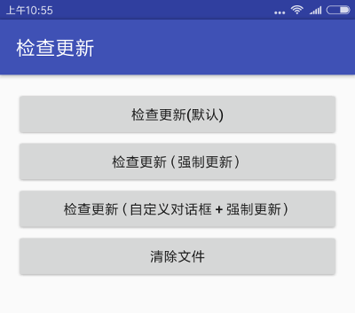

[](https://bintray.com/openproject/maven/android-update)

# AU - Android Update
the best android check update library!



## Gradle

```groovy
compile('com.jayfeng:android-update:3.0.1');
```

## Overview
> * simple and reliable
> * support Android7.0+
> * no more need permission problem
> * no more need dialog ui
> * open source

## Usage
```groovy
/**
 * AU init - MUST
 * Notice: downloadWhenCacel means slient download when cancel
 * if the network is WIFI and the app has the WRITE_EXTERNAL_STORAGE permission
 */
private void initAUConfig() {
    AUConfig auConfig = new AUConfig();
    // must
    auConfig.setContext(getApplicationContext()); // Context
    auConfig.setUpdateIcon(R.mipmap.ic_launcher); // Notification icon
    // optional
    auConfig.setDownloadWhenCacel(true);
    AU.init(auConfig);
}
```

SHOW UI:
```java
// default AlertDialog style
AU.show(MainActivity.this,
        mVersion.getVercode(), mVersion.getVername(), mVersion.getDownload(), mVersion.getLog(), mVersion.isForce());
// or, you can customize the update dialog yourself
if (AU.hasUpdate(version.getVersion_code())) {
    final UpdateDialog updateDialog = new UpdateDialog(this);
    updateDialog.setTitle("发现新版本");
    updateDialog.setContent(version.getChange_log());
    updateDialog.setOnOkListener(new View.OnClickListener() {
        @Override
        public void onClick(View view) {
            // click confirm
            AU.auConfirm(MainActivity.this, updateDialog, version.getDownload(), version.getForce());
        }
    });
    updateDialog.setOnCancelListener(new DialogInterface.OnCancelListener() {
        @Override
        public void onCancel(DialogInterface dialogInterface) {
            // click cancel
            AU.auCancel(MainActivity.this, updateDialog, version.getDownload());
        }
    });
    updateDialog.show();
}
```
为了兼容Android 7.0+的FileProvider，而Provider是不能冲突的，所以必须自定义这个Provider的author:
```groovy
android {
    defaultConfig {
        resValue "string", "au_provider_file_authorities", "<packageName>.fileprovider"
    }
}
```
切记！切记！一定要加！不支持Android7.0+的也要加！

## Author

> Author weibo：<a href="http://weibo.com/xiaofengjian" target="_blank">冯建V</a>&nbsp;&nbsp;&nbsp;&nbsp;mail：673592063@qq.com&nbsp;&nbsp;&nbsp;&nbsp;QQ：673592063

## License

```
Copyright (C)  LessCode Open Source Project

Licensed under the Apache License, Version 2.0 (the "License");
you may not use this file except in compliance with the License.
You may obtain a copy of the License at

http://www.apache.org/licenses/LICENSE-2.0

Unless required by applicable law or agreed to in writing, software
distributed under the License is distributed on an "AS IS" BASIS,
WITHOUT WARRANTIES OR CONDITIONS OF ANY KIND, either express or implied.
See the License for the specific language governing permissions and
limitations under the License.
```
